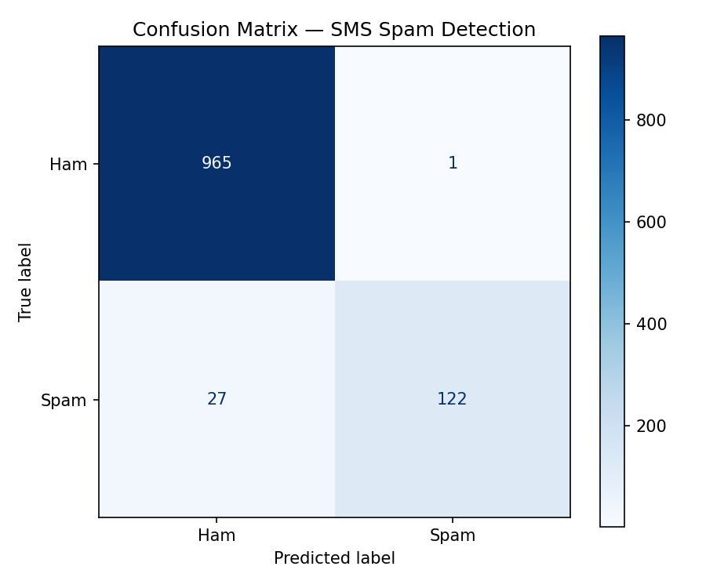
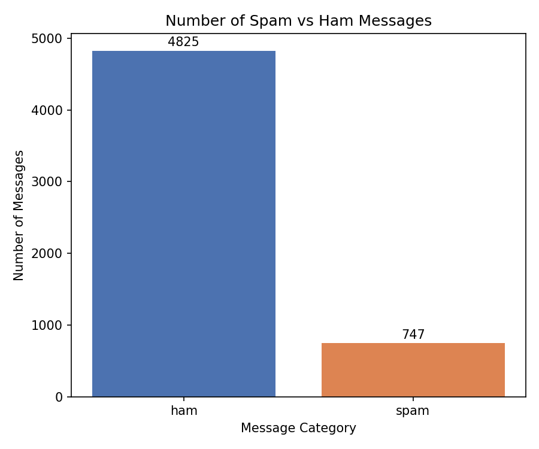

# 📱 SMS Spam Detection using NLP

A Natural Language Processing (NLP) and Machine Learning project that classifies SMS messages as either **Spam** or **Ham**.

The project demonstrates a complete text classification workflow using Python, from loading and preparing textual data to feature extraction, model training, prediction, and evaluation.

---

## 📌 Project Overview

Spam messages are unwanted messages that may contain advertisements, fraudulent offers, or potentially harmful content. Automatically identifying such messages is a practical application of Natural Language Processing and Machine Learning.

In this project, an SMS dataset is used to train a machine learning model capable of distinguishing between:

- 📩 **Ham** — legitimate/normal messages
- 🚨 **Spam** — unwanted or spam messages

The project uses **CountVectorizer** to convert text into numerical features and **Logistic Regression** for classification.

---

## 🎯 Objectives

- Understand the basics of NLP-based text classification
- Explore and analyze SMS message data
- Convert textual data into numerical features
- Train a Machine Learning classification model
- Evaluate model performance using accuracy and a confusion matrix
- Build a simple function for predicting new SMS messages

---

## 📊 Dataset

The dataset contains **5,572 SMS messages** with two columns:

| Column | Description |
|---|---|
| `Category` | Message category: `ham` or `spam` |
| `Message` | The actual SMS text |

### Dataset Distribution

| Category | Number of Messages |
|---|---:|
| Ham | 4,825 |
| Spam | 747 |
| **Total** | **5,572** |

The dataset is therefore imbalanced, with considerably more Ham messages than Spam messages.

---

## 🔄 Project Workflow

```text
SMS Dataset
     ↓
Load Dataset
     ↓
Explore Message Categories
     ↓
Encode Labels
     ↓
Train-Test Split
     ↓
CountVectorizer
     ↓
Logistic Regression
     ↓
Predictions
     ↓
Model Evaluation
     ↓
Spam / Ham Classification
```

---

## 🛠️ Technologies & Libraries

- **Python**
- **Pandas** — data loading and manipulation
- **Matplotlib** — data visualization
- **Scikit-learn** — machine learning and evaluation
- **Jupyter Notebook** — development environment

### Machine Learning Techniques

- Train-Test Split
- CountVectorizer
- Logistic Regression
- Accuracy Score
- Confusion Matrix

---

## ⚙️ Implementation

### 1. Data Preparation

The dataset is loaded using Pandas and the message column is converted to string format.

The target labels are encoded as:

```text
ham  → 0
spam → 1
```

### 2. Train-Test Split

The dataset is divided into training and testing sets using an **80/20 split**.

A stratified split is used to preserve the class distribution between the training and testing sets.

```python
X_train, X_test, y_train, y_test = train_test_split(
    X, y,
    test_size=0.2,
    random_state=42,
    stratify=y
)
```

### 3. Text Feature Extraction

Since Machine Learning models work with numerical data, the SMS messages are converted into numerical feature vectors using **CountVectorizer**.

```python
vectorizer = CountVectorizer(stop_words="english")

X_train_vec = vectorizer.fit_transform(X_train)
X_test_vec = vectorizer.transform(X_test)
```

### 4. Model Training

A **Logistic Regression** classifier is trained using the vectorized SMS messages.

```python
model = LogisticRegression(max_iter=1000)

model.fit(X_train_vec, y_train)
```

### 5. Prediction

The trained model predicts whether unseen messages belong to the Ham or Spam category.

---

## 📈 Model Performance

The Logistic Regression model achieved:

### **97.49% Accuracy**

on the test dataset.

```text
Accuracy: 97.49%
```

---

## 📊 Confusion Matrix

The model produced the following confusion matrix:

| Actual / Predicted | Ham | Spam |
|---|---:|---:|
| **Ham** | 965 | 1 |
| **Spam** | 27 | 122 |

### Results

- **True Negative (TN):** 965
- **False Positive (FP):** 1
- **False Negative (FN):** 27
- **True Positive (TP):** 122



The confusion matrix shows that the model correctly classified the majority of messages in both categories.

---

## 📊 Ham vs Spam Distribution



The dataset contains significantly more Ham messages than Spam messages, highlighting the class imbalance present in the dataset.

---

## 🔍 Example Prediction

The project also includes a function that accepts a new SMS message and predicts whether it is Spam or Ham.

```python
def predict_message(message):
    vector = vectorizer.transform([message])
    prediction = model.predict(vector)[0]

    return "🚨 SPAM MESSAGE" if prediction == 1 else "📩 HAM MESSAGE"
```

Example:

```text
Enter an SMS message: Hey, are we meeting today?

Prediction: 📩 HAM MESSAGE
```

---

## 📁 Project Structure

```text
SMS-Spam-Detection/
│
├── spam_detection.ipynb
├── spam.xlsx
├── confusion_matrix.png
├── spam_vs_ham_chart.png
└── README.md
```

---

## 💡 Key Learning Outcomes

Through this project, I gained practical experience in:

- Working with real-world textual data
- Performing basic data exploration
- Preparing text data for Machine Learning
- Converting text into numerical features using CountVectorizer
- Building a Logistic Regression classifier
- Splitting data into training and testing sets
- Evaluating classification performance
- Understanding and interpreting a confusion matrix
- Implementing predictions for new text inputs

---

## 🚀 Future Improvements

Possible improvements to this project include:

- Comparing multiple NLP classification algorithms
- Experimenting with TF-IDF feature extraction
- Applying more advanced text preprocessing
- Evaluating additional metrics such as Precision, Recall, and F1-Score
- Handling class imbalance using appropriate techniques
- Exploring more advanced NLP and deep learning approaches

---

## 👨‍💻 Author

**Mrinmoy Debnath**

Engineering Student | Aspiring AI/ML Developer

---

⭐ If you find this project useful, feel free to explore the notebook and give the repository a star!
